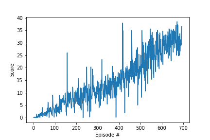

# Project Report

### Project Goal
In this environment, a double-jointed arm can move to target locations. A reward of +0.1 is provided for each step that the agent's hand is in the goal location. Thus, the goal of your agent is to maintain its position at the target location for as many time steps as possible.

### Environment Details

* **Number of agents**: 1;
* **State Space**: observation space consists of 33 variables corresponding to position, rotation, velocity, and angular velocities of the arm;
* **Action Space**: Each action is a vector with 4 numbers, corresponding to torque applicable to two joints, values in action vector must be a number between -1 and 1;
* **Rewards**: +0.1 for each step that the agent's hand is in the goal location;
* **Goal**: maintain its position at the target location for as many time steps as possible.

### Learning Algorithm
It was used the Deep Deterministic Policy Gradient(DDPG) algorithm, which is a Policy Gradient appoach. The algorithm is using the Actor-Critic approach.

The Actor is a neural network that approximates a deterministic policy, It takes in input the state and the output is an array of values, one for each action. It approximates the policy π(a|s;θπ). This policy is deterministic and it represents the policy value in the action space, with values in the range [-1,1].

The Critic is used to give feedback about the value of the input state observed by the actor and the action considered by the actor for that state. The feedback is computed using the gradient of the the advantage function computed using the tuple (state, next_state, action, reward) sampled from the memory buffer.

Both Actor and Critic have a target and regular networks. The target network is used to define the desiredtarget, avoiding to have the same network for considering the prediction and the target. This is the same idea used in the DQN algorithm.

A soft update approach is implemented, which means that the target network is updated more often but with a smmaler change.

The DDPG, as many policy gradient algorithm, suffers from having large variance, due to their Monte Carlo approach in computing the cumulative reward. To reduce the variance, a Temporal Difference approach is used together with bootstrapping of one, this approach reduces the variance but introduces a bias.

The exploration of the action space is done by injecting a noise after the action has been selected from the Actor Network.

### Network Architectures

#### Actor
```
Input nodes (33) 
Fully Connected Layer (400 nodes, Relu activation) 
Batch Normlization
Fully Connected Layer (300 nodes, Relu activation) 
Ouput nodes (4 nodes, tanh activation)
```
#### Critic
```
Input nodes (33) 
Fully Connected Layer (400 nodes, Relu activation) 
Batch Normalization
Fully Connected Layer (300 nodes, Relu activation) 
Ouput nodes (1 node)
```

### Chosen Hyper-Parameters

| Hyper-Parameters | Description                                           |  Default   |
| ---------------- | ----------------------------------------------------- | :--------: |
| `random_seed`    | The random seed                                       |   `667`    |
| `lr_actor`       | Learning rate for the Actor Model                     |   `2e-4`   |
| `lr_critic`      | Learning rate for the Critic Model                    |   `1e-4`   |
| `w_decay`        | L2 weight decay for Critic Model                      |    `0`    |
| `buffer_size`    | The replay memory buffer size                         | `int(1e5)` |
| `batch_size`     | Mini-batch size                                       |   `128`    |
| `gamma`          | Reward discount factor                                |   `0.99`   |
| `tau`            | For soft update of target parameters                  |   `1e-3`   |
| `add_noise`      | Add noise to action space during training             |   `True`   |
| `update_every`   | Time step interval for learning from experiences      |    `20`    |
| `num_update`     | Number of times to updatea after timesteps            |    `10`    |
| `target_avg`     | Average score required to consider environment solved |   `30.0`   |
| `n_episodes`     | Maximum number of episodes to train the models        |   `1000`   |

### Training Results
Below is the plot showing the training epochs and their respective rewards.


### Future Work
* Implement Distributed Distributional Deterministic Policy Gradients (D4PG) algorithm and compare its performance with DDPG;
* Implement PPO and A3C algorithms and compare their performances with DDPG
